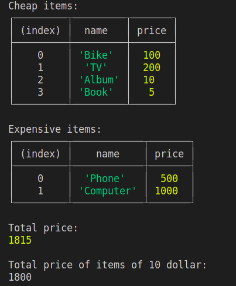

# Contact form html & css challenge
## The first challenge
The challenge was to replicate the following image

It was the folder html&css it is containing the results

## The second challenge
The second challenge to consider the following
> const item = [ {name: 'Bike', price:100}, {name: 'TV', price:200}, {name: 'Album', price:10}, {name: 'Book', price:5}, {name: 'Phone', price:500}, {name: 'Computer', price:1000} ]

Then do the following
> 1 . Filter and show the product that will be bought when you don't have much money I mean Cheap one
> 2 . Filter and show the product that will be expensive in the array
> 3 . Calculate the full price of all product combined
> 4 . Calculate the full price of all product combined and remove product that are under the 10 dollar

Results:
